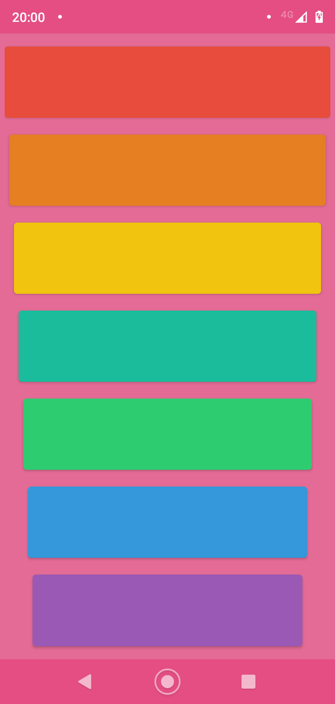

# Xylophone

Simulator of a xylophone, for play some songs.

It's very simple, you only click on a button and is going to play a musical note.

* Red: C
* Orange: D
* Yellow: E
* Turquoise: F
* Green: H
* Blue: A
* Purple: B

